# Precursor signatures - mining evidence report

Generated 2026-08-19 06:28:59 UTC from `auc_by_lead.csv` / `rankings.csv` (this directory). Dev cohort only (holdout 2018+ untouched, enforced in `data.py`). 39 candidate features; leads [6, 12, 24, 48, 72] h; AUC = P(event value > control value) at the given lead, computed on values at rel hour -lead (onset-aligned; controls aligned on their pseudo-onset).

## Series used

| class | events | controls |
|---|---|---|
| flash_flood | 1472 | 2944 |
| flood | 2429 | 4858 |
| destructive_wind | 2055 | 4110 |
| tornado | 1587 | 3174 |

## flash_flood

### Top 8 features (ranked by |AUC-0.5| at -24 h)

| feature | AUC @-6h | AUC @-12h | AUC @-24h | AUC @-48h | AUC @-72h |
|---|---|---|---|---|---|
| `tcwv_anom_7d` | 0.796 | 0.760 | 0.684 | 0.584 | 0.549 |
| `tcwv` | 0.726 | 0.697 | 0.644 | 0.577 | 0.550 |
| `precip_sum_12h` | 0.760 | 0.710 | 0.634 | 0.547 | 0.534 |
| `precip_sum_6h` | 0.750 | 0.699 | 0.632 | 0.540 | 0.529 |
| `rain_on_sat_6h` | 0.751 | 0.701 | 0.632 | 0.541 | 0.530 |
| `rain_on_sat_24h` | 0.767 | 0.712 | 0.630 | 0.555 | 0.533 |
| `precip_sum_24h` | 0.764 | 0.709 | 0.629 | 0.555 | 0.534 |
| `dewpoint_dep` | 0.306 | 0.320 | 0.376 | 0.434 | 0.447 |

#### `tcwv_anom_7d` - TCWV minus its own 7-day rolling mean (kg/m2)

AUC 0.684 at -24 h (Cliff's delta +0.37, robust d 0.45; n=1472/2937). Events run **higher** than controls (median 4.53 vs 0.10).

| rel hour | -168 | -72 | -48 | -24 | -12 | -6 | 0 |
|---|---|---|---|---|---|---|---|
| event median | -0.13 | 1.17 | 1.83 | 4.53 | 6.86 | 8.67 | 9.95 |
| event IQR | -4.49..5.03 | -3.28..6.20 | -2.48..6.84 | 0.18..10.01 | 2.39..12.48 | 3.21..14.13 | 4.45..15.90 |
| control median | 0.04 | 0.11 | -0.17 | 0.10 | 0.22 | 0.18 | -0.15 |

*Physical reading (moisture):* low-level moisture and instability proxies (ERA5 has no CAPE).

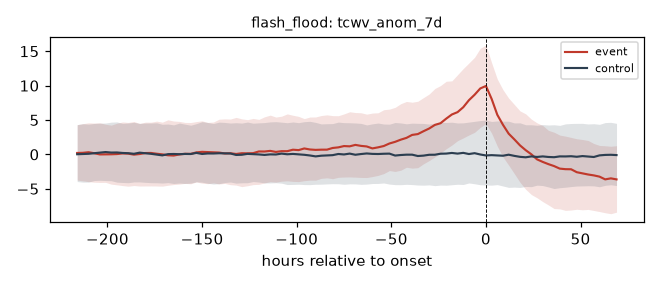

#### `tcwv` - total column water vapour (kg/m2)

AUC 0.644 at -24 h (Cliff's delta +0.29, robust d 0.37; n=1472/2937). Events run **higher** than controls (median 32.15 vs 23.80).

| rel hour | -168 | -72 | -48 | -24 | -12 | -6 | 0 |
|---|---|---|---|---|---|---|---|
| event median | 24.75 | 26.50 | 28.50 | 32.15 | 35.20 | 37.35 | 40.10 |
| event IQR | 14.67..36.70 | 16.00..38.80 | 17.90..39.60 | 21.97..42.82 | 25.45..45.50 | 27.70..47.00 | 29.27..49.60 |
| control median | 24.10 | 23.70 | 23.40 | 23.80 | 24.30 | 24.30 | 24.10 |

*Physical reading (moisture):* low-level moisture and instability proxies (ERA5 has no CAPE).

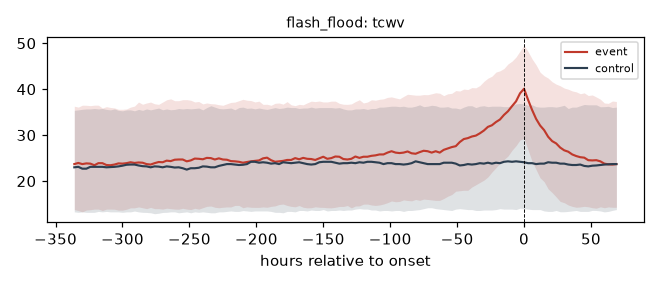

#### `precip_sum_12h` - 12 h rainfall accumulation (mm)

AUC 0.634 at -24 h (Cliff's delta +0.27, robust d 0.38; n=1472/2944). Events run **higher** than controls (median 0.60 vs 0.00).

| rel hour | -168 | -72 | -48 | -24 | -12 | -6 | 0 |
|---|---|---|---|---|---|---|---|
| event median | 0.00 | 0.00 | 0.00 | 0.60 | 1.70 | 3.40 | 7.40 |
| event IQR | 0.00..1.10 | 0.00..1.60 | 0.00..1.90 | 0.00..4.00 | 0.00..7.53 | 0.20..10.40 | 1.90..18.78 |
| control median | 0.00 | 0.00 | 0.00 | 0.00 | 0.00 | 0.00 | 0.00 |

*Physical reading (rain):* direct rainfall loading - sustained or intense antecedent precipitation.

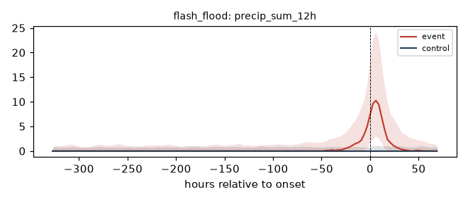

#### `precip_sum_6h` - 6 h rainfall accumulation (mm)

AUC 0.632 at -24 h (Cliff's delta +0.26, robust d 0.33; n=1472/2944). Events run **higher** than controls (median 0.20 vs 0.00).

| rel hour | -168 | -72 | -48 | -24 | -12 | -6 | 0 |
|---|---|---|---|---|---|---|---|
| event median | 0.00 | 0.00 | 0.00 | 0.20 | 0.60 | 1.40 | 4.60 |
| event IQR | 0.00..0.30 | 0.00..0.50 | 0.00..0.70 | 0.00..2.10 | 0.00..4.00 | 0.00..6.00 | 0.98..12.50 |
| control median | 0.00 | 0.00 | 0.00 | 0.00 | 0.00 | 0.00 | 0.00 |

*Physical reading (rain):* direct rainfall loading - sustained or intense antecedent precipitation.

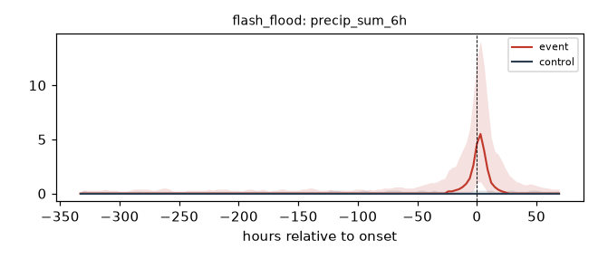

#### `rain_on_sat_6h` - 6 h rain accumulation x soil-moisture percentile

AUC 0.632 at -24 h (Cliff's delta +0.26, robust d 0.16; n=1472/2942). Events run **higher** than controls (median 0.05 vs 0.00).

| rel hour | -168 | -72 | -48 | -24 | -12 | -6 | 0 |
|---|---|---|---|---|---|---|---|
| event median | 0.00 | 0.00 | 0.00 | 0.05 | 0.30 | 0.94 | 4.11 |
| event IQR | 0.00..0.13 | 0.00..0.27 | 0.00..0.34 | 0.00..1.48 | 0.00..3.70 | 0.00..5.74 | 0.57..12.07 |
| control median | 0.00 | 0.00 | 0.00 | 0.00 | 0.00 | 0.00 | 0.00 |

*Physical reading (interaction):* compound signal: rain falling on already-saturated soil (runoff efficiency).

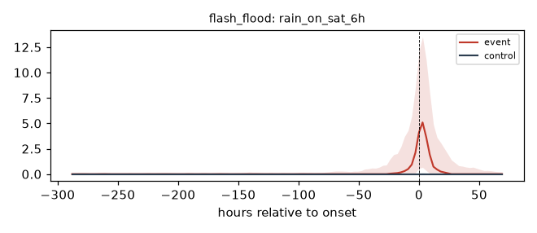

### Non-separating features (|AUC-0.5| < 0.05 at every lead)

`blh`, `blh_delta_24h`, `dir_veer_6h`, `snow_accum_14d`, `snowmelt_proxy`, `wspd_delta_6h`

Recorded to prevent re-derivation churn.

## flood

### Top 8 features (ranked by |AUC-0.5| at -24 h)

| feature | AUC @-6h | AUC @-12h | AUC @-24h | AUC @-48h | AUC @-72h |
|---|---|---|---|---|---|
| `rain_on_sat_24h` | 0.664 | 0.645 | 0.610 | 0.574 | 0.551 |
| `precip_sum_24h` | 0.658 | 0.641 | 0.607 | 0.572 | 0.549 |
| `rain_on_sat_72h` | 0.657 | 0.638 | 0.606 | 0.574 | 0.561 |
| `precip_sum_12h` | 0.659 | 0.639 | 0.606 | 0.568 | 0.545 |
| `precip_sum_48h` | 0.653 | 0.634 | 0.604 | 0.570 | 0.556 |
| `precip_sum_72h` | 0.644 | 0.626 | 0.597 | 0.573 | 0.560 |
| `rain_on_sat_6h` | 0.658 | 0.634 | 0.595 | 0.555 | 0.539 |
| `tcwv_anom_7d` | 0.627 | 0.617 | 0.593 | 0.555 | 0.543 |

#### `rain_on_sat_24h` - 24 h rain accumulation x soil-moisture percentile

AUC 0.610 at -24 h (Cliff's delta +0.22, robust d 0.32; n=2429/4837). Events run **higher** than controls (median 2.51 vs 0.44).

| rel hour | -168 | -72 | -48 | -24 | -12 | -6 | 0 |
|---|---|---|---|---|---|---|---|
| event median | 0.69 | 1.19 | 1.51 | 2.51 | 3.93 | 4.66 | 5.68 |
| event IQR | 0.00..5.72 | 0.01..7.17 | 0.02..8.70 | 0.08..10.63 | 0.18..13.60 | 0.29..15.56 | 0.48..18.00 |
| control median | 0.42 | 0.51 | 0.52 | 0.44 | 0.46 | 0.50 | 0.53 |

*Physical reading (interaction):* compound signal: rain falling on already-saturated soil (runoff efficiency).

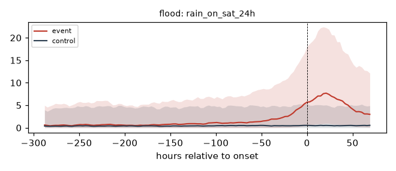

#### `precip_sum_24h` - 24 h rainfall accumulation (mm)

AUC 0.607 at -24 h (Cliff's delta +0.21, robust d 0.33; n=2429/4858). Events run **higher** than controls (median 4.70 vs 1.60).

| rel hour | -168 | -72 | -48 | -24 | -12 | -6 | 0 |
|---|---|---|---|---|---|---|---|
| event median | 2.10 | 2.90 | 3.40 | 4.70 | 6.10 | 7.10 | 8.40 |
| event IQR | 0.00..8.50 | 0.20..10.10 | 0.20..12.00 | 0.40..13.50 | 0.90..16.60 | 1.10..18.60 | 1.50..20.90 |
| control median | 1.60 | 1.80 | 1.70 | 1.60 | 1.60 | 1.80 | 1.70 |

*Physical reading (rain):* direct rainfall loading - sustained or intense antecedent precipitation.

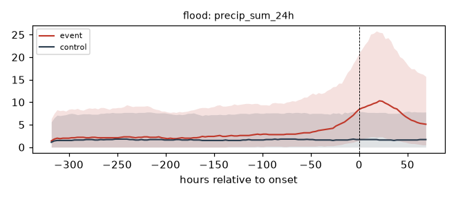

#### `rain_on_sat_72h` - 72 h rain accumulation x soil-moisture percentile

AUC 0.606 at -24 h (Cliff's delta +0.21, robust d 0.31; n=2429/4837). Events run **higher** than controls (median 9.56 vs 3.54).

| rel hour | -168 | -72 | -48 | -24 | -12 | -6 | 0 |
|---|---|---|---|---|---|---|---|
| event median | 4.36 | 6.08 | 7.40 | 9.56 | 12.33 | 14.02 | 15.90 |
| event IQR | 0.21..16.85 | 0.47..21.27 | 0.61..23.07 | 1.06..27.71 | 1.71..31.79 | 2.10..35.08 | 3.22..38.64 |
| control median | 3.12 | 3.44 | 3.40 | 3.54 | 3.44 | 3.43 | 3.42 |

*Physical reading (interaction):* compound signal: rain falling on already-saturated soil (runoff efficiency).

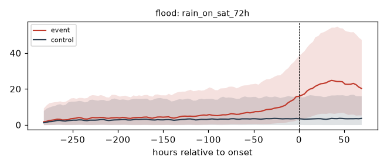

#### `precip_sum_12h` - 12 h rainfall accumulation (mm)

AUC 0.606 at -24 h (Cliff's delta +0.21, robust d 0.28; n=2429/4858). Events run **higher** than controls (median 1.30 vs 0.20).

| rel hour | -168 | -72 | -48 | -24 | -12 | -6 | 0 |
|---|---|---|---|---|---|---|---|
| event median | 0.30 | 0.50 | 0.80 | 1.30 | 2.90 | 3.50 | 3.10 |
| event IQR | 0.00..3.30 | 0.00..4.00 | 0.00..4.90 | 0.00..6.30 | 0.20..9.70 | 0.30..10.10 | 0.20..10.80 |
| control median | 0.20 | 0.20 | 0.20 | 0.20 | 0.50 | 0.60 | 0.20 |

*Physical reading (rain):* direct rainfall loading - sustained or intense antecedent precipitation.

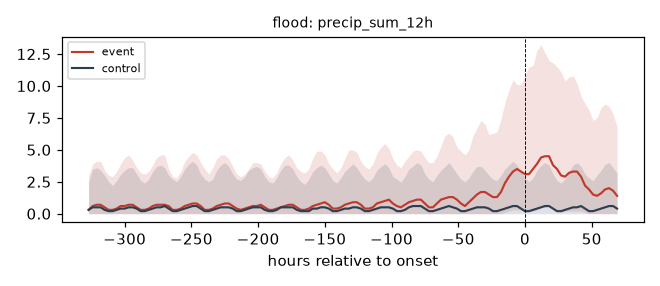

#### `precip_sum_48h` - 48 h rainfall accumulation (mm)

AUC 0.604 at -24 h (Cliff's delta +0.21, robust d 0.30; n=2429/4858). Events run **higher** than controls (median 10.50 vs 4.90).

| rel hour | -168 | -72 | -48 | -24 | -12 | -6 | 0 |
|---|---|---|---|---|---|---|---|
| event median | 5.90 | 7.90 | 8.70 | 10.50 | 12.90 | 14.30 | 16.20 |
| event IQR | 0.60..17.60 | 1.20..20.20 | 1.30..21.90 | 1.80..26.60 | 2.80..29.20 | 3.40..31.70 | 4.30..35.60 |
| control median | 4.80 | 5.10 | 4.90 | 4.90 | 4.90 | 4.85 | 4.90 |

*Physical reading (rain):* direct rainfall loading - sustained or intense antecedent precipitation.

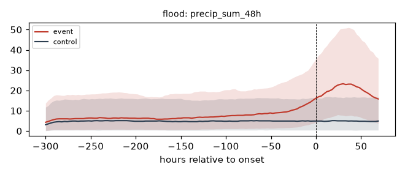

### Non-separating features (|AUC-0.5| < 0.05 at every lead)

`blh`, `blh_delta_24h`, `dir_veer_6h`, `gust_delta_6h`, `gust_factor`, `mslp_tend_3h`, `mslp_tend_6h`, `snow_accum_14d`, `snowmelt_proxy`, `theta_e`, `theta_e_delta_24h`, `wspd_delta_6h`

Recorded to prevent re-derivation churn.

## destructive_wind

### Top 8 features (ranked by |AUC-0.5| at -24 h)

| feature | AUC @-6h | AUC @-12h | AUC @-24h | AUC @-48h | AUC @-72h |
|---|---|---|---|---|---|
| `mslp_tend_24h` | 0.071 | 0.106 | 0.190 | 0.354 | 0.450 |
| `gust` | 0.863 | 0.831 | 0.734 | 0.581 | 0.530 |
| `mslp_hpa` | 0.115 | 0.171 | 0.266 | 0.387 | 0.438 |
| `wspd_10m` | 0.814 | 0.797 | 0.712 | 0.576 | 0.531 |
| `tcwv_anom_7d` | 0.886 | 0.850 | 0.710 | 0.541 | 0.515 |
| `gust_max_24h` | 0.872 | 0.826 | 0.701 | 0.566 | 0.524 |
| `tcwv` | 0.833 | 0.799 | 0.692 | 0.555 | 0.534 |
| `mslp_tend_6h` | 0.161 | 0.221 | 0.331 | 0.439 | 0.478 |

#### `mslp_tend_24h` - 24 h MSLP tendency (hPa)

AUC 0.190 at -24 h (Cliff's delta -0.62, robust d -0.89; n=2055/4110). Events run **lower** than controls (median -2.60 vs -0.10).

| rel hour | -168 | -72 | -48 | -24 | -12 | -6 | 0 |
|---|---|---|---|---|---|---|---|
| event median | -0.10 | -0.40 | -0.90 | -2.60 | -4.60 | -7.40 | -11.50 |
| event IQR | -1.10..0.90 | -1.40..0.70 | -2.20..0.20 | -4.20..-1.10 | -7.80..-2.50 | -12.60..-4.00 | -19.95..-5.40 |
| control median | 0.00 | 0.00 | 0.00 | -0.10 | 0.00 | 0.00 | 0.00 |

*Physical reading (pressure):* synoptic-scale cyclone approach / deepening (pressure falls precede wind and rain).

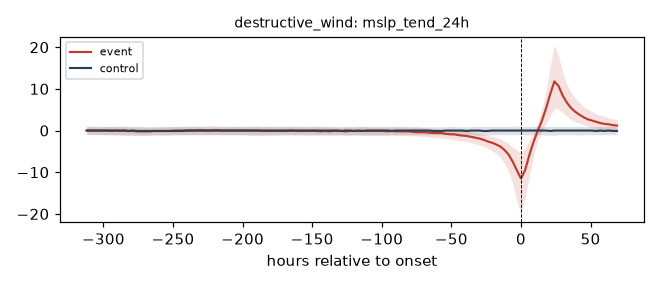

#### `gust` - 10 m wind gust (m/s)

AUC 0.734 at -24 h (Cliff's delta +0.47, robust d 0.67; n=2055/4110). Events run **higher** than controls (median 11.40 vs 7.80).

| rel hour | -168 | -72 | -48 | -24 | -12 | -6 | 0 |
|---|---|---|---|---|---|---|---|
| event median | 7.70 | 8.20 | 8.90 | 11.40 | 15.00 | 17.30 | 15.60 |
| event IQR | 5.40..10.10 | 5.70..10.70 | 6.20..11.70 | 8.30..15.30 | 10.40..19.90 | 11.50..23.50 | 11.10..21.20 |
| control median | 7.60 | 7.80 | 7.80 | 7.80 | 7.70 | 7.90 | 7.80 |

*Physical reading (wind):* strengthening low-level flow ahead of or during the event.

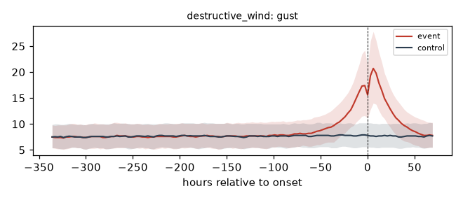

#### `mslp_hpa` - mean sea-level pressure (hPa)

AUC 0.266 at -24 h (Cliff's delta -0.47, robust d -0.61; n=2055/4110). Events run **lower** than controls (median 1007.40 vs 1011.10).

| rel hour | -168 | -72 | -48 | -24 | -12 | -6 | 0 |
|---|---|---|---|---|---|---|---|
| event median | 1010.80 | 1010.10 | 1009.50 | 1007.40 | 1004.50 | 1001.70 | 995.30 |
| event IQR | 1008.50..1013.70 | 1007.60..1013.40 | 1006.70..1012.70 | 1003.70..1010.40 | 999.00..1008.20 | 993.50..1006.90 | 984.25..1003.70 |
| control median | 1011.20 | 1011.15 | 1011.20 | 1011.10 | 1011.30 | 1012.10 | 1011.20 |

*Physical reading (pressure):* synoptic-scale cyclone approach / deepening (pressure falls precede wind and rain).

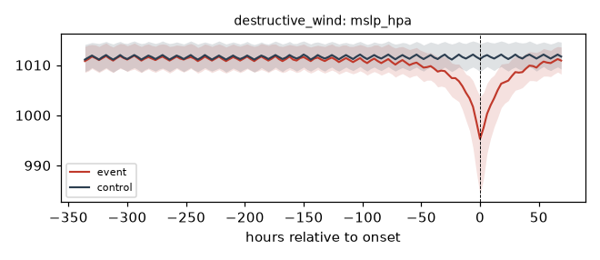

#### `wspd_10m` - 10 m mean wind speed (m/s)

AUC 0.712 at -24 h (Cliff's delta +0.42, robust d 0.64; n=2055/4110). Events run **higher** than controls (median 8.20 vs 5.12).

| rel hour | -168 | -72 | -48 | -24 | -12 | -6 | 0 |
|---|---|---|---|---|---|---|---|
| event median | 5.06 | 5.47 | 6.01 | 8.20 | 10.79 | 12.23 | 8.54 |
| event IQR | 3.18..7.08 | 3.23..7.71 | 3.54..8.53 | 5.01..11.34 | 6.53..14.55 | 6.79..16.81 | 5.41..12.45 |
| control median | 5.02 | 5.22 | 5.15 | 5.12 | 5.14 | 5.23 | 5.15 |

*Physical reading (wind):* strengthening low-level flow ahead of or during the event.

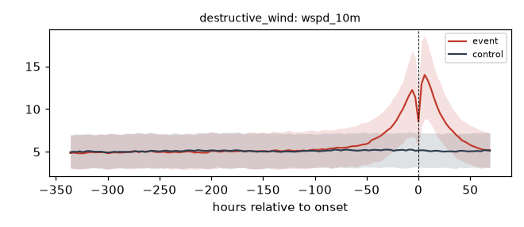

#### `tcwv_anom_7d` - TCWV minus its own 7-day rolling mean (kg/m2)

AUC 0.710 at -24 h (Cliff's delta +0.42, robust d 0.60; n=2055/4099). Events run **higher** than controls (median 6.43 vs 0.01).

| rel hour | -168 | -72 | -48 | -24 | -12 | -6 | 0 |
|---|---|---|---|---|---|---|---|
| event median | 0.28 | 0.19 | 1.30 | 6.43 | 11.33 | 14.11 | 15.61 |
| event IQR | -4.57..4.69 | -4.32..5.08 | -4.27..6.56 | 0.12..12.72 | 5.89..16.67 | 8.21..20.02 | 8.93..21.82 |
| control median | 0.08 | -0.04 | 0.01 | 0.01 | -0.16 | -0.04 | 0.07 |

*Physical reading (moisture):* low-level moisture and instability proxies (ERA5 has no CAPE).

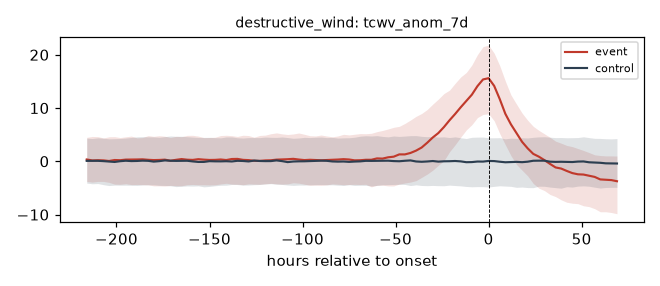

### Non-separating features (|AUC-0.5| < 0.05 at every lead)

`dir_veer_6h`, `sm2_delta_7d`, `sm_0_7`, `sm_7_28`, `sm_delta_7d`, `sm_pct`, `sm_sat_ratio`, `snow_accum_14d`, `snowmelt_proxy`

Recorded to prevent re-derivation churn.

## tornado

### Top 8 features (ranked by |AUC-0.5| at -24 h)

| feature | AUC @-6h | AUC @-12h | AUC @-24h | AUC @-48h | AUC @-72h |
|---|---|---|---|---|---|
| `mslp_hpa` | 0.124 | 0.189 | 0.301 | 0.388 | 0.474 |
| `theta_e` | 0.774 | 0.743 | 0.656 | 0.591 | 0.547 |
| `tcwv` | 0.790 | 0.743 | 0.643 | 0.567 | 0.516 |
| `tcwv_anom_7d` | 0.811 | 0.758 | 0.637 | 0.552 | 0.489 |
| `theta_e_delta_24h` | 0.740 | 0.696 | 0.616 | 0.581 | 0.513 |
| `mslp_tend_24h` | 0.230 | 0.290 | 0.397 | 0.409 | 0.478 |
| `gust_max_24h` | 0.743 | 0.661 | 0.602 | 0.563 | 0.537 |
| `gust` | 0.775 | 0.731 | 0.591 | 0.550 | 0.512 |

#### `mslp_hpa` - mean sea-level pressure (hPa)

AUC 0.301 at -24 h (Cliff's delta -0.40, robust d -0.51; n=1587/3174). Events run **lower** than controls (median 1010.90 vs 1015.30).

| rel hour | -168 | -72 | -48 | -24 | -12 | -6 | 0 |
|---|---|---|---|---|---|---|---|
| event median | 1015.30 | 1014.80 | 1012.80 | 1010.90 | 1009.20 | 1007.00 | 1003.90 |
| event IQR | 1010.60..1019.20 | 1010.85..1018.65 | 1009.40..1016.90 | 1007.80..1014.50 | 1006.40..1012.60 | 1003.90..1010.40 | 1000.40..1007.65 |
| control median | 1015.40 | 1015.30 | 1015.40 | 1015.30 | 1016.15 | 1016.40 | 1015.60 |

*Physical reading (pressure):* synoptic-scale cyclone approach / deepening (pressure falls precede wind and rain).

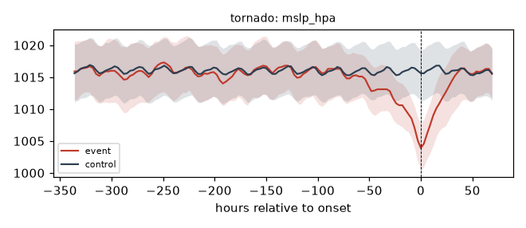

#### `theta_e` - surface equivalent potential temperature proxy (K, Bolton approx)

AUC 0.656 at -24 h (Cliff's delta +0.31, robust d 0.36; n=1587/3174). Events run **higher** than controls (median 318.07 vs 309.60).

| rel hour | -168 | -72 | -48 | -24 | -12 | -6 | 0 |
|---|---|---|---|---|---|---|---|
| event median | 310.35 | 312.13 | 314.59 | 318.07 | 319.24 | 324.97 | 327.68 |
| event IQR | 296.81..321.86 | 298.22..322.71 | 302.85..325.67 | 308.65..328.02 | 309.83..326.60 | 318.04..331.44 | 320.74..333.61 |
| control median | 307.54 | 309.34 | 309.22 | 309.60 | 303.58 | 308.43 | 309.06 |

*Physical reading (moisture):* low-level moisture and instability proxies (ERA5 has no CAPE).

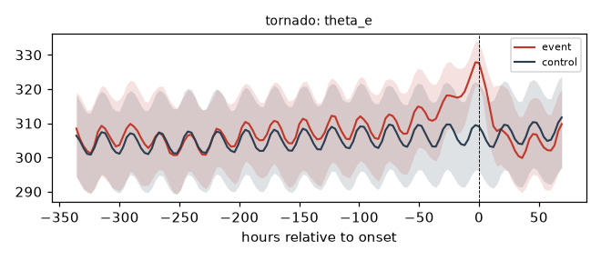

#### `tcwv` - total column water vapour (kg/m2)

AUC 0.643 at -24 h (Cliff's delta +0.29, robust d 0.38; n=1587/3170). Events run **higher** than controls (median 24.90 vs 18.60).

| rel hour | -168 | -72 | -48 | -24 | -12 | -6 | 0 |
|---|---|---|---|---|---|---|---|
| event median | 18.50 | 18.80 | 21.50 | 24.90 | 29.10 | 30.70 | 35.50 |
| event IQR | 11.05..28.80 | 12.40..27.60 | 14.40..29.00 | 18.20..31.50 | 22.85..34.70 | 25.60..36.20 | 29.20..41.05 |
| control median | 17.60 | 18.30 | 18.40 | 18.60 | 18.10 | 18.10 | 18.30 |

*Physical reading (moisture):* low-level moisture and instability proxies (ERA5 has no CAPE).

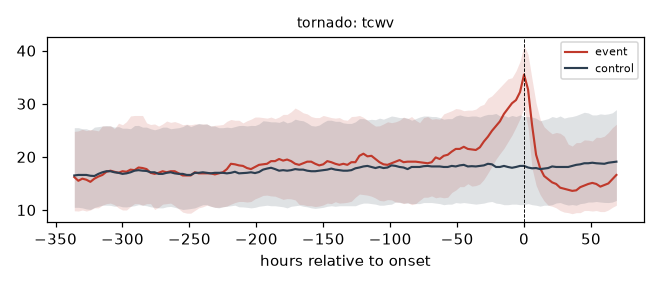

#### `tcwv_anom_7d` - TCWV minus its own 7-day rolling mean (kg/m2)

AUC 0.637 at -24 h (Cliff's delta +0.27, robust d 0.36; n=1587/3170). Events run **higher** than controls (median 4.01 vs -0.01).

| rel hour | -168 | -72 | -48 | -24 | -12 | -6 | 0 |
|---|---|---|---|---|---|---|---|
| event median | 0.36 | -0.12 | 1.66 | 4.01 | 8.10 | 9.71 | 13.54 |
| event IQR | -4.48..6.57 | -5.16..5.95 | -3.47..7.63 | -1.10..10.01 | 2.32..12.99 | 4.98..14.05 | 8.83..18.08 |
| control median | 0.16 | 0.29 | 0.00 | -0.01 | -0.47 | -0.45 | 0.04 |

*Physical reading (moisture):* low-level moisture and instability proxies (ERA5 has no CAPE).

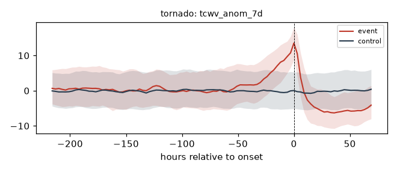

#### `theta_e_delta_24h` - 24 h change in theta-e proxy (K)

AUC 0.616 at -24 h (Cliff's delta +0.23, robust d 0.29; n=1587/3174). Events run **higher** than controls (median 4.57 vs 1.67).

| rel hour | -168 | -72 | -48 | -24 | -12 | -6 | 0 |
|---|---|---|---|---|---|---|---|
| event median | 0.66 | 1.32 | 2.95 | 4.57 | 6.50 | 8.03 | 7.76 |
| event IQR | -5.30..5.44 | -4.03..6.54 | -2.21..8.81 | -0.84..9.60 | 1.02..13.54 | 1.98..14.64 | 2.08..15.13 |
| control median | 1.07 | 1.20 | 1.17 | 1.67 | 1.31 | 1.35 | 1.08 |

*Physical reading (moisture):* low-level moisture and instability proxies (ERA5 has no CAPE).

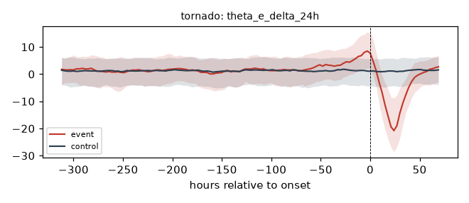

### Non-separating features (|AUC-0.5| < 0.05 at every lead)

`dir_veer_6h`, `sm2_delta_7d`, `sm_7_28`, `snow_accum_14d`, `snowmelt_proxy`

Recorded to prevent re-derivation churn.

